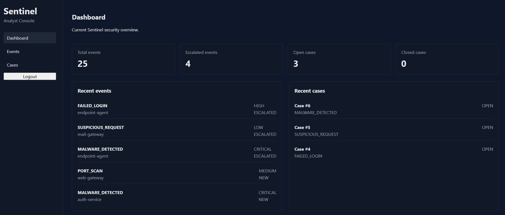
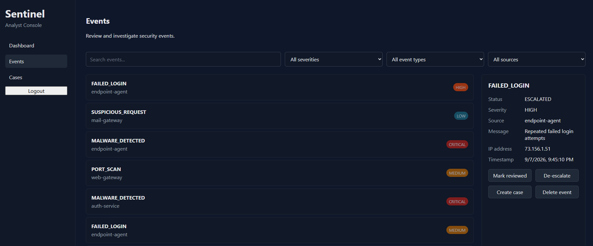
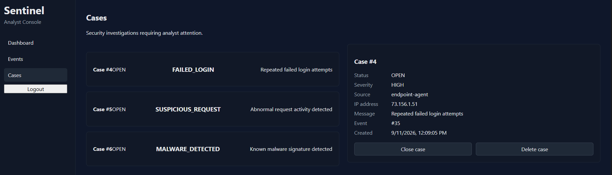
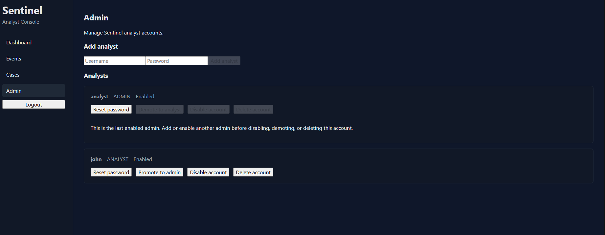

# Sentinel

Sentinel is a full-stack security event monitoring and investigation platform built with React, Spring Boot and PostgreSQL.

It provides an analyst console for reviewing security events, escalating incidents into investigation cases, managing analyst accounts and roles, and monitoring a production-style containerised application.



## Highlights

- Security event ingestion, filtering and investigation
- Event review and escalation workflow
- Investigation case management
- Session-based authentication with CSRF protection
- `ADMIN` and `ANALYST` role-based authorization
- Analyst account creation, password reset, enable/disable and deletion
- Protection against disabling, deleting or demoting the final enabled administrator
- Immediate session revalidation when an account is disabled, deleted or changes role
- PostgreSQL persistence with Flyway migrations
- Integration testing with Testcontainers
- Request rate limiting
- Spring Boot Actuator health monitoring
- Dockerised frontend, backend, database and Nginx reverse proxy
- GitHub Actions CI/CD
- Backend and frontend images published to GitHub Container Registry
- Authenticated traffic simulator for generating realistic security events

## Screenshots

### Security Events

Analysts can search and filter incoming events, inspect their details, mark them as reviewed, escalate them, and create investigation cases.




### Investigation Cases

Cases provide a separate workflow for tracking security incidents through investigation and closure.



### Analyst Administration

Administrators can manage users, roles, passwords and account state while backend safeguards preserve at least one enabled administrator.



## Architecture

```text
User
  ↓
Browser
  ↓
Nginx
  ├──→ React frontend
  │
  └──→ Spring Boot API
            ↓
        PostgreSQL
```

The application uses a layered backend architecture:

```text
HTTP Request
    ↓
Spring Security
    ↓
Controller
    ↓
Service
    ↓
Repository
    ↓
PostgreSQL
```

More detail is available in:

```text
docs/architecture.md
```

## Security

Sentinel uses server-side Spring Security sessions.

After login, the browser receives a `JSESSIONID` cookie while authentication state remains on the backend.

State-changing requests use CSRF protection.

Sentinel supports:

```text
ADMIN
ANALYST
```

Routes under:

```text
/api/admin/**
```

require the `ADMIN` role.

Authenticated sessions are revalidated against the current analyst record in PostgreSQL. This means:

```text
disabled account
→ session invalidated
→ 401 Unauthorized

deleted account
→ session invalidated
→ 401 Unauthorized

role changed
→ authorities refreshed
→ current database role is enforced
```

Administrative safeguards prevent the final enabled administrator from being disabled, deleted or demoted.

## Technology Stack

### Backend

- Java 21
- Spring Boot
- Spring Security
- Spring Data JPA
- Hibernate
- PostgreSQL
- Flyway
- Maven
- Testcontainers
- Spring Boot Actuator

### Frontend

- React
- TypeScript
- Vite

### Infrastructure

- Docker
- Docker Compose
- Nginx
- GitHub Actions
- GitHub Container Registry

## Repository Structure

```text
sentinel/
├── backend/
│   ├── src/
│   ├── pom.xml
│   ├── Dockerfile
│   └── compose.yaml
│
├── web/
│   ├── src/
│   ├── package.json
│   └── Dockerfile
│
├── deployment/
│   ├── docker-compose.prod.yml
│   └── nginx-proxy.conf
│
├── scripts/
│   └── traffic-simulator.py
│
├── docs/
│   ├── architecture.md
│   └── screenshots/
│
└── .github/
    └── workflows/
        ├── backend-ci.yml
        └── web-ci.yml
```

## Local Development

### Backend

```bash
cd backend
docker compose up -d postgres
mvn spring-boot:run
```

Backend:

```text
http://localhost:8080
```

### Frontend

In another terminal:

```bash
cd web
npm ci
npm run dev
```

Frontend:

```text
http://localhost:5173
```

## Traffic Simulator

Sentinel includes an authenticated traffic simulator that generates realistic security events through the normal API.

Example:

```bash
python3 scripts/traffic-simulator.py \
  --username analyst \
  --password 'YOUR_PASSWORD' \
  --count 20
```

The simulator:

```text
retrieves CSRF token
→ logs in
→ maintains Spring session cookie
→ generates events
→ POSTs them through /api/events
```

It can also be used to demonstrate rate limiting by increasing the request frequency.

## Testing

Backend integration tests require Docker because Testcontainers provisions PostgreSQL automatically.

```bash
cd backend
mvn test
```

Frontend production build:

```bash
cd web
npm run build
```

## Database Migrations

Flyway owns database schema changes.

Migration files are stored under:

```text
backend/src/main/resources/db/migration/
```

Hibernate validates the schema rather than automatically modifying the production database.

## Production Deployment

Production uses Docker images published to GitHub Container Registry:

```text
ghcr.io/ibrahimzah33r/sentinel-backend:latest
ghcr.io/ibrahimzah33r/sentinel-web:latest
```

Environment-specific configuration is supplied through:

```text
deployment/.env
```

The `.env` file is excluded from Git.

### Pull latest images

```bash
docker compose \
  -p sentinel \
  --env-file deployment/.env \
  -f deployment/docker-compose.prod.yml \
  pull
```

### Start or update the stack

```bash
docker compose \
  -p sentinel \
  --env-file deployment/.env \
  -f deployment/docker-compose.prod.yml \
  up -d
```

### Check status

```bash
docker compose \
  -p sentinel \
  --env-file deployment/.env \
  -f deployment/docker-compose.prod.yml \
  ps
```

### View logs

```bash
docker compose \
  -p sentinel \
  --env-file deployment/.env \
  -f deployment/docker-compose.prod.yml \
  logs -f
```

### Stop

```bash
docker compose \
  -p sentinel \
  --env-file deployment/.env \
  -f deployment/docker-compose.prod.yml \
  down
```

Do not use `down -v` unless the PostgreSQL data volume is intentionally being removed.

## CI/CD

The monorepo contains separate GitHub Actions workflows for the backend and frontend.

Backend changes:

```text
backend/**
→ Maven tests
→ Docker build
→ sentinel-backend image
→ GHCR
```

Frontend changes:

```text
web/**
→ npm build
→ Docker build
→ sentinel-web image
→ GHCR
```

This keeps the source code in one repository while preserving separate deployable backend and frontend images.