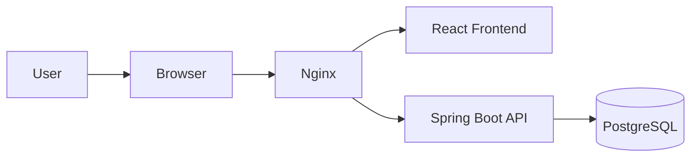
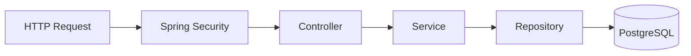
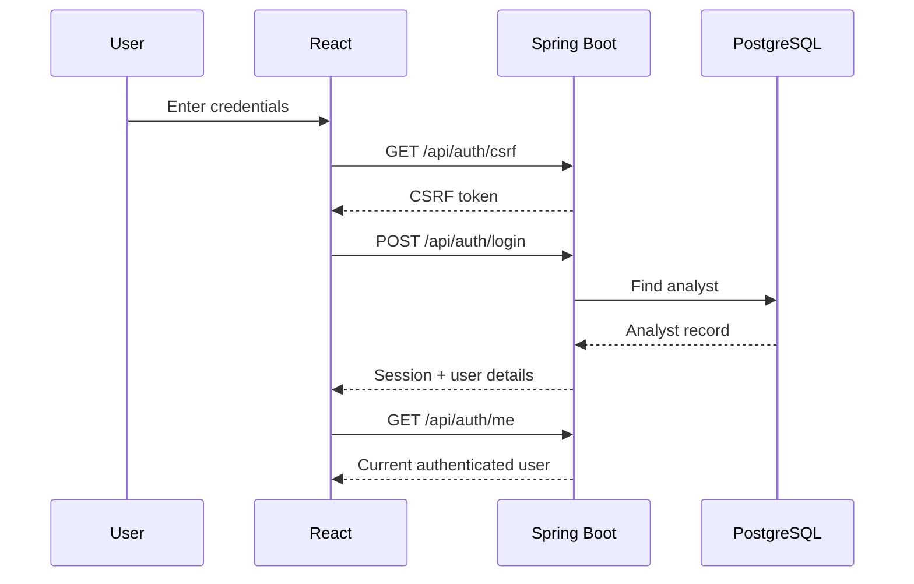
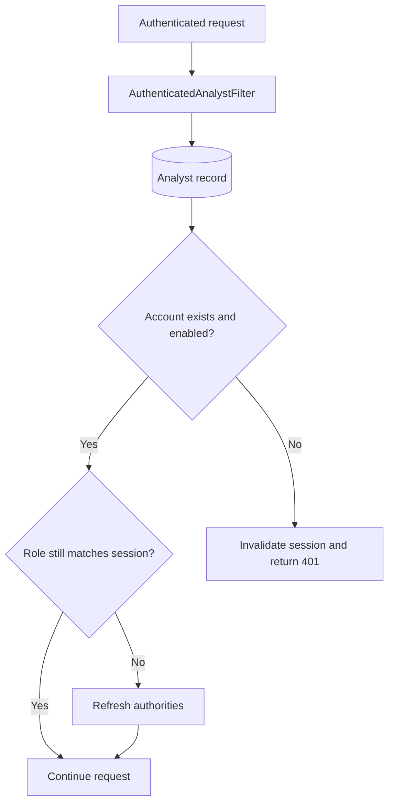
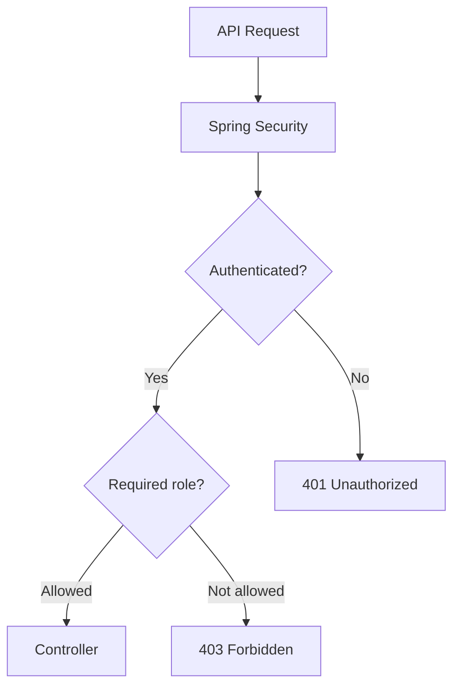
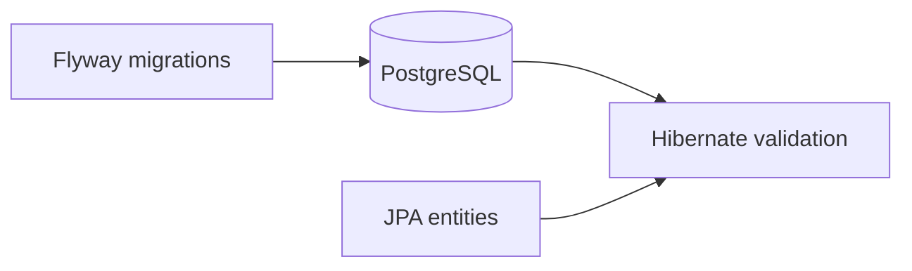
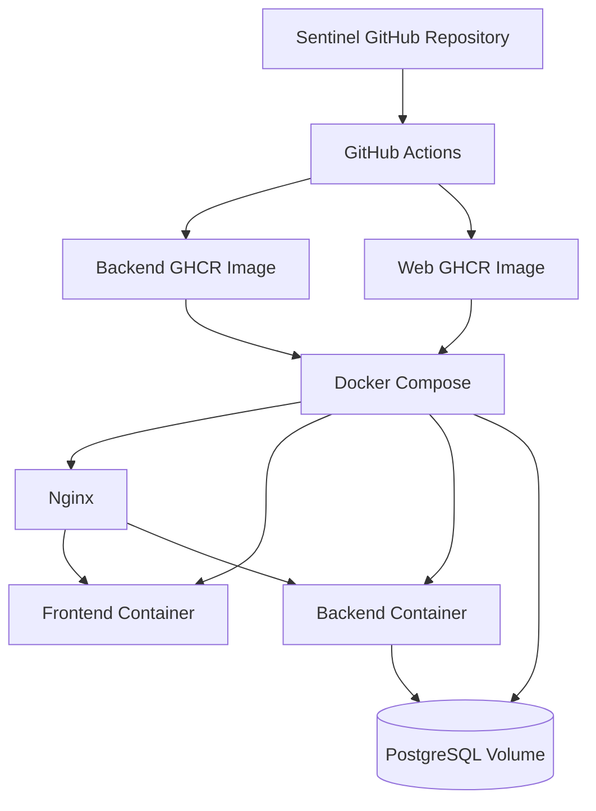
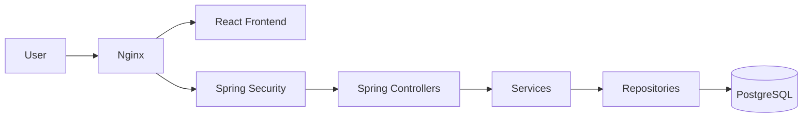

# Sentinel Architecture

## System Overview



Sentinel is a full-stack security event and investigation case management application.

- **React** provides the analyst interface.
- **Nginx** serves as the production entry point and routes frontend and API traffic.
- **Spring Boot** handles authentication, authorization and application logic.
- **PostgreSQL** stores analysts, security events and investigation cases.

The source code is maintained in a monorepo:

```text
sentinel/
├── backend/
├── web/
├── deployment/
└── docs/
```

## Backend Architecture



Controllers handle HTTP requests and responses.

Services contain application and business rules.

Repositories provide persistence through Spring Data JPA.

DTOs separate the external API contract from persistence entities.

## Authentication



Authentication uses a server-side Spring Security session.

The browser stores a `JSESSIONID` cookie while authentication state remains on the backend.

CSRF protection is used for state-changing authenticated requests.

## Session Revalidation

Authenticated requests are revalidated against the current analyst record in PostgreSQL.



This means:

```text
deleted analyst
→ session invalidated
→ 401 Unauthorized
```

```text
disabled analyst
→ session invalidated
→ 401 Unauthorized
```

```text
role changed
→ authorities refreshed
→ subsequent authorization uses the current database role
```

A demoted administrator therefore cannot continue using stale administrator privileges from an existing session.

## Authorization



Sentinel supports:

- `ADMIN`
- `ANALYST`

Routes under:

```text
/api/admin/**
```

require the `ADMIN` role.

Administrative account-management rules also ensure that at least one enabled administrator remains.

The final enabled administrator cannot be:

- disabled
- deleted
- demoted to `ANALYST`

## Database



Flyway owns schema changes.

Migration files live under:

```text
backend/src/main/resources/db/migration/
```

Hibernate validates the schema rather than automatically modifying the production database.

This keeps schema changes explicit and version controlled.

## Frontend

The React frontend acts as the analyst console.

It communicates with the backend through the `/api` routes and uses the authenticated browser session for protected operations.

Administrative UI controls are shown according to the authenticated user's role.

The frontend also prevents obviously invalid administrator actions in the interface, such as disabling, deleting or demoting the final enabled administrator.

Backend validation remains authoritative.

## Deployment



The source code lives in one GitHub monorepo, while the backend and frontend are built as independent Docker images:

```text
ghcr.io/ibrahimzah33r/sentinel-backend
ghcr.io/ibrahimzah33r/sentinel-web
```

Docker Compose pulls those images and runs:

```text
PostgreSQL
Backend
Frontend
Nginx
```

Production configuration is stored under:

```text
deployment/
├── docker-compose.prod.yml
└── nginx-proxy.conf
```

Environment-specific secrets are supplied through:

```text
deployment/.env
```

Secrets are not committed to Git.

## CI/CD

The monorepo contains separate GitHub Actions workflows for each deployable component.

```text
backend change
→ backend workflow
→ Maven tests
→ Docker build
→ sentinel-backend image
```

```text
web change
→ web workflow
→ npm build
→ Docker build
→ sentinel-web image
```

Path filters prevent unrelated backend or frontend changes from unnecessarily triggering both pipelines.

## Production Request Flow



This keeps the frontend, security layer, application logic and persistence responsibilities clearly separated.
